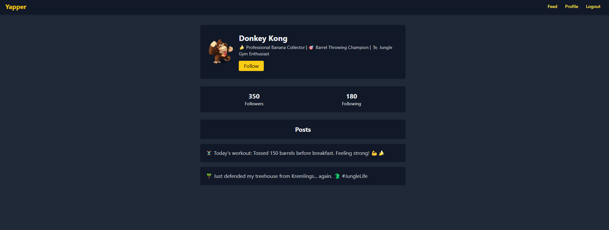

# Yapper - Social Media Frontend



## Description

Welcome to **Yapper** — a playful social media frontend built using **HTML**, **TailwindCSS**, and **SASS**.\
Yapper provides a minimal, responsive platform where users can create posts, search feeds, view profiles, and interact using a like system.

This project focuses on frontend development using TailwindCSS to create a modern, mobile-first, fully responsive design.

---

## Table of Contents

- [Description](#description)
- [Table of Contents](#table-of-contents)
- [Built With](#built-with)
- [Setup and Installation](#setup-and-installation)
- [Usage](#usage)
- [Branching Strategy](#branching-strategy)
- [Development Scripts](#development-scripts)
- [Contributing](#contributing)
- [License](#license)
- [Contact](#contact)

---

## Built With

- &#x20;— Markup language for structuring the content.
- &#x20;— Utility-first CSS framework for styling.
- &#x20;— CSS preprocessor for advanced styling control.
- &#x20;— Fast frontend build tool.
- JavaScript (minimal interactivity, like button toggling).

---

## Setup and Installation

1. **Clone the repository:**

   ```bash
   git clone https://github.com/Sigrid-Okt22PT/yapper-social-media-app.git
   ```

2. **Navigate into your project directory:**

   ```bash
   cd your-repo-name
   ```

3. **Install dependencies:**

   ```bash
   npm install
   ```

4. **Start development server (watch mode):**

   ```bash
   npm run dev
   ```

5. **Build production files (minified output):**

   ```bash
   npm run build
   ```

---

## Usage

- **Authentication Page**: Log in or register using the form at `/index.html`.
- **Feed Page**: Browse user posts, search content, create new posts, like/unlike posts at `/feed/index.html`.
- **Profile Page**: View user profile image, username, followers/following stats, and user posts at `/profile/index.html`.

---

## Branching Strategy

- All feature development was done on a branch named `css-frameworks`.
- A Pull Request was submitted from `css-frameworks` to the `main` branch.
- This ensures clean version control and professional project management.

---

## Development Scripts

```json
"scripts": {
  "dev": "npx tailwindcss -i ./css/input.css -o ./css/style.css --watch",
  "build": "npx tailwindcss -i ./css/input.css -o ./css/style.css --minify"
}
```

- `npm run dev` — Watches files for live updates during development.
- `npm run build` — Outputs a production-ready minified CSS.

---

## Contributing

Contributions are welcome!\
If you'd like to contribute:

1. **Fork** this repository.
2. **Clone** your fork:
   ```bash
   git clone https://github.com/YOUR_USERNAME/YOUR_REPO_NAME.git
   ```
3. **Create a new branch:**
   ```bash
   git checkout -b feature-branch
   ```
4. **Commit your changes:**
   ```bash
   git commit -m "Add your commit message"
   ```
5. **Push your branch:**
   ```bash
   git push origin feature-branch
   ```
6. **Create a Pull Request**.

---

## License

This project is licensed under the **MIT License** — free for personal and educational use.

---

## Contact

[My LinkedIn Profile](https://www.linkedin.com/in/sigrid-johanne-husev%C3%A5g-132513a5/)

---

# 🎉 Thanks for checking out Yapper!
