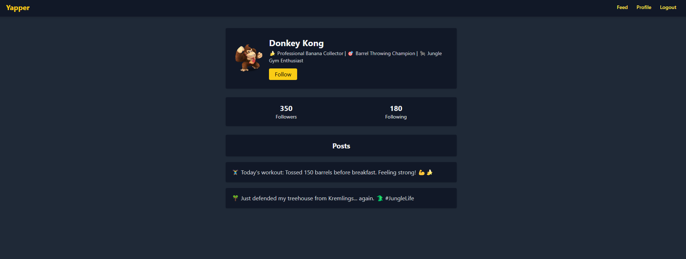

# Yapper - Social Media Frontend


## Description

Welcome to **Yapper** — a playful social media frontend built using **HTML**, **TailwindCSS**, and **modern JavaScript**.  
Yapper provides a minimal, responsive platform where users can create posts, search feeds, view profiles, and interact using a like system.

This project focuses on frontend development using TailwindCSS to create a modern, mobile-first, fully responsive design, while JavaScript adds interactivity and API communication.

---

## Table of Contents

- [Description](#description)
- [Table of Contents](#table-of-contents)
- [Built With](#built-with)
- [JavaScript Features](#javascript-features)
- [Setup and Installation](#setup-and-installation)
- [Testing Locally](#testing-locally)
- [Usage](#usage)
- [Branching Strategy](#branching-strategy)
- [Development Scripts](#development-scripts)
- [Contributing](#contributing)
- [License](#license)
- [Contact](#contact)

---

## Built With

- **HTML** — Markup language for structuring the content.
- **TailwindCSS** — Utility-first CSS framework for styling.
- **SASS** — CSS preprocessor for advanced styling control.
- **Vite** — Fast frontend build tool.
- **JavaScript** — Modular ES6 code for interactivity and API integration.

---

## JavaScript Features

This project demonstrates the use of **modern JavaScript techniques**:

- **ES6 Modules**  
  Code is organized into separate modules (`script.js`, `posts.js`, etc.) and imported using `type="module"` for better structure and reusability.

- **Destructuring**  
  Arrays and objects are destructured for cleaner and more concise code.  
  Example:  
  ```js
  const { title, body, author } = post;
  const [first, ...rest] = posts;
  ```

- **JSDoc Documentation**  
  API helper functions are documented with JSDoc to improve developer experience.  
  Example:  
  ```js
  /**
   * Delete a post by ID.
   * @param {string|number} id
   * @returns {Promise<void>}
   */
  export async function deletePost(id) {
    await apiSocial(`/posts/${encodeURIComponent(id)}`, { method: "DELETE" });
  }
  ```

- **Debugging & Error Handling**  
  Async functions are wrapped in `try/catch`, and API requests return meaningful error messages.  
  Example:
  ```js
  try {
    await updatePost(id, payload);
    fb.textContent = "Saved!";
  } catch (err) {
    fb.textContent = err.message || "Failed to save.";
  }
  ```

- **Form Handling with FormData**  
  Forms use `FormData` and `e.preventDefault()` to avoid full-page reloads.  
  Example:
  ```js
  const fd = new FormData(form);
  const title = String(fd.get('title')||'').trim();
  ```

- **Dynamic Rendering**  
  Posts and comments are rendered dynamically using template literals and Tailwind utility classes.

---

## Setup and Installation

1. **Clone the repository:**
   ```bash
   git clone -b css-frameworks https://github.com/Sigrid-Okt22PT/yapper-app.git
   ```

2. **Navigate into your project directory:**
   ```bash
   cd yapper-app
   ```

3. **Install dependencies:**
   ```bash
   npm install
   ```

4. **Start development server (watch mode):**
   ```bash
   npm run dev
   ```

5. **Build production files (minified output):**
   ```bash
   npm run build
   ```

---

## Testing Locally

When opening `.html` files directly in a browser without a server, navigation between pages may not work correctly.  
To fix this, you can use **Live Preview**:

1. Install the **Live Preview** extension in Visual Studio Code.  
2. Open the project folder.  
3. Right-click on `index.html` and select **Show Preview**.  

This launches your project at a local address (e.g., `http://127.0.0.1:3000/`) and enables full navigation functionality.

Login with any email address and a password with at least 8 characters.

---

## Usage

- **Authentication Page**: Log in or register using the form at `/index.html`.  
- **Feed Page**: Browse user posts, search content, create new posts, like/unlike posts at `/feed/index.html`.  
- **Profile Page**: View user profile image, username, followers/following stats, and user posts at `/profile/index.html`.  

---

## Branching Strategy

- All feature development was done on a branch named `css-frameworks`.  
- A Pull Request was submitted from `css-frameworks` to the `main` branch.  
- This ensures clean version control and professional project management.

---

## Development Scripts

```json
"scripts": {
  "dev": "npx tailwindcss -i ./css/input.css -o ./css/style.css --watch",
  "build": "npx tailwindcss -i ./css/input.css -o ./css/style.css --minify"
}
```

- `npm run dev` — Watches files for live updates during development.  
- `npm run build` — Outputs a production-ready minified CSS.  

---

## Contributing

Contributions are welcome!  
If you'd like to contribute:

1. **Fork** this repository.  
2. **Clone** your fork:  
   ```bash
   git clone -b css-frameworks https://github.com/Sigrid-Okt22PT/yapper-app.git
   ```
3. **Create a new branch:**  
   ```bash
   git checkout -b feature-branch
   ```
4. **Commit your changes:**  
   ```bash
   git commit -m "Add your commit message"
   ```
5. **Push your branch:**  
   ```bash
   git push origin feature-branch
   ```
6. **Create a Pull Request**.  

---

## License

This project is licensed under the **MIT License** — free for personal and educational use.

---

## Contact

[My LinkedIn Profile](https://www.linkedin.com/in/sigrid-johanne-husev%C3%A5g-132513a5/)

---

# 🎉 Thanks for checking out Yapper!
